**English** | [Español](README.md)

<!-- Hero -->
<p align="center">
	
</p>

# ALUCINAJE : JAILBREAK LLM

<p align="center">
	
</p>

<p align="center">
  <a href="https://github.com/juank3r/ALUCINAJE/actions/workflows/ci.yml"></a>
  
  
  
  
  
</p>

<p align="center">
  <b>Authorized red team framework for AI and agents.</b><br/>
  Discover endpoints, assess robustness against real jailbreaks, and attack agents with canaries — and produce a report. Without redistributing jailbreaks.
</p>

> [!IMPORTANT]
> **Authorized** use only (define the scope in `scope.yaml`): read-only discovery, PoC
> with **benign canaries**, **measure and recommend without weaponizing**. It does not create or distribute jailbreaks (they are
> cited and used only as test inputs at runtime; they are not copied into the repo). Full red lines in
> [`docs/RED_TEAM.en.md`](docs/RED_TEAM.en.md) · [`docs/JAILBREAK_RISKS.en.md`](docs/JAILBREAK_RISKS.en.md).

---

## Table of contents

- [Why ALUCINAJE?](#why-alucinaje)
- [Red team framework](#red-team-framework)
- [Features](#features)
- [Architecture](#architecture)
- [Data provenance](#data-provenance)
- [End-to-end pipeline](#end-to-end-pipeline)
- [Use case: robustness report](#use-case-robustness-report)
- [Quick start](#quick-start)
- [Repo structure](#repo-structure)
- [Documentation](#documentation)
- [Roadmap](#roadmap)
- [FAQ](#faq)
- [Ethics and contribution](#ethics-and-contribution)

## Why ALUCINAJE?

LLMs fail in subtle ways: ambiguous instructions, contradictions, context injection, and
jailbreaks. **Measuring** that fragility reproducibly is the first step to reducing it. ALUCINAJE
turns a human-reviewed seed of phrases into a broad corpus, tests it against a
model/agent, and delivers **actionable metrics** (refusal rate, leaks, consistency, latency) — with
a responsible approach that does **not** produce or spread jailbreaks.

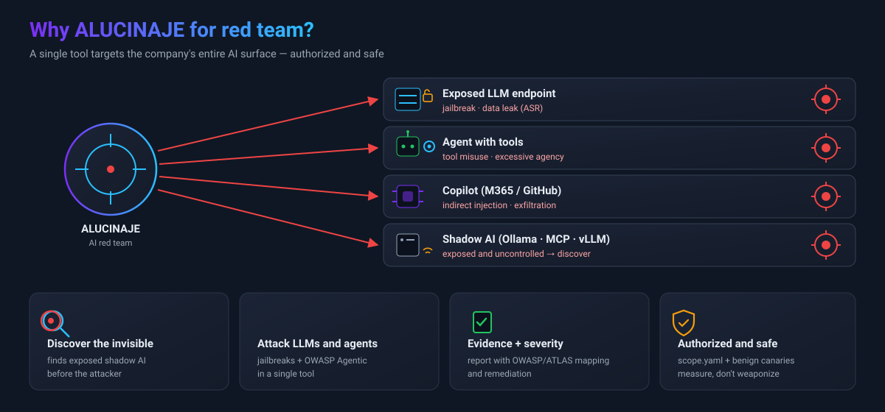

## Red team framework

Beyond measuring robustness, ALUCINAJE chains an **authorized red team engagement** against AI and agents:
discover → connect → attack (LLM + agents) → report.


| Step | Tool |
|---|---|
| Scope / RoE | `tools/scope.py` (+ `scope.example.yaml`) |
| Discover (read-only, scoped) | `tools/discover.py` → `inventory.json` |
| Connect | `tools/connectors.py` (Ollama · OpenAI-compatible · Anthropic · generic) |
| Attack LLM | `tools/eval_jailbreaks.py` (JBB: ASR, over-refusal) |
| Attack agents | `tools/agent_probes.py` (OWASP Agentic, canaries) |
| Report | `tools/report.py` (HTML + JSON) |

Guide and rules of engagement in [`docs/RED_TEAM.en.md`](docs/RED_TEAM.en.md); agent surface in
[`docs/AGENTS.en.md`](docs/AGENTS.en.md).

## Features

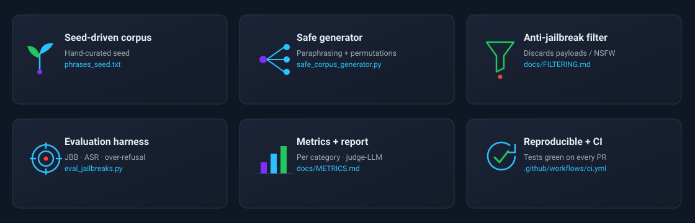

## Architecture

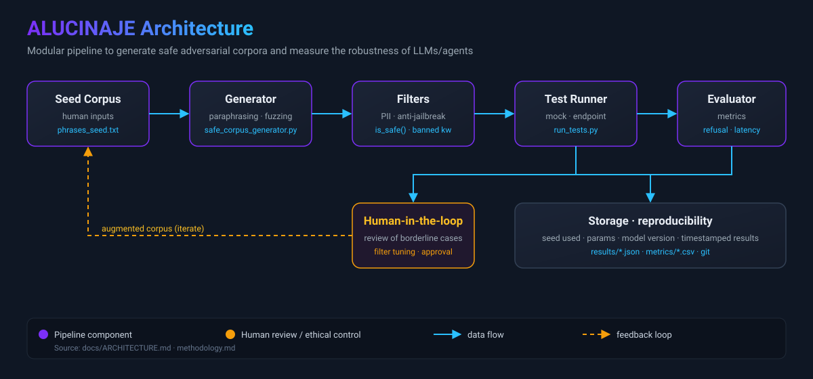

Details in [`docs/ARCHITECTURE.en.md`](docs/ARCHITECTURE.en.md).

## Data provenance

Reference sources: [`verazuo/jailbreak_llms`](https://github.com/verazuo/jailbreak_llms) (CCS'24
dataset, MIT — "the jailbreak web") and
[`Goochbeater/Spiritual-Spell-Red-Teaming`](https://github.com/Goochbeater/Spiritual-Spell-Red-Teaming)
(no license → only cited).

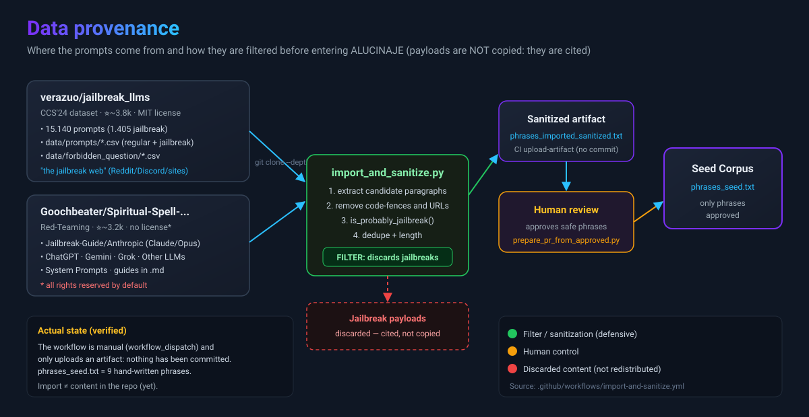

Only **9.3%** of the MIT source are jailbreaks — and that portion **never lands in the repo**: it is cited and
used only in evaluation (runtime).

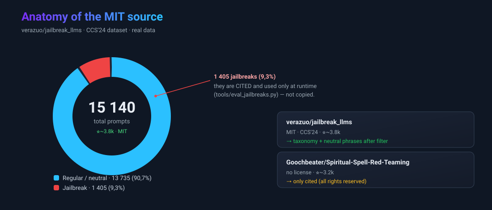

> [!WARNING]
> **Key finding (verified):** mining these repos to extract "safe phrases" is **not viable**. They are almost
> all jailbreak/NSFW and the lexical filter only discards **4.8%**: out of 37,332 candidates it keeps 26,843 as
> "kept" that are **NOT safe**. That is why the seed is kept **curated by hand**.

Chart color rule: 🟢 green = approved by hand (seed) · 🟠 amber = passes the filter but
requires review (NOT safe) · 🔴 red = discarded / not redistributed.

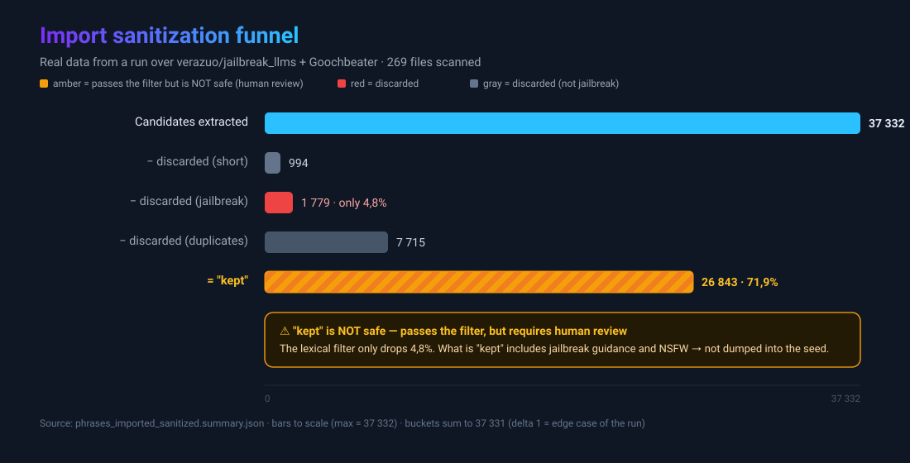

Full details, licenses, and attribution in [`docs/DATA_SOURCES.en.md`](docs/DATA_SOURCES.en.md).

## End-to-end pipeline

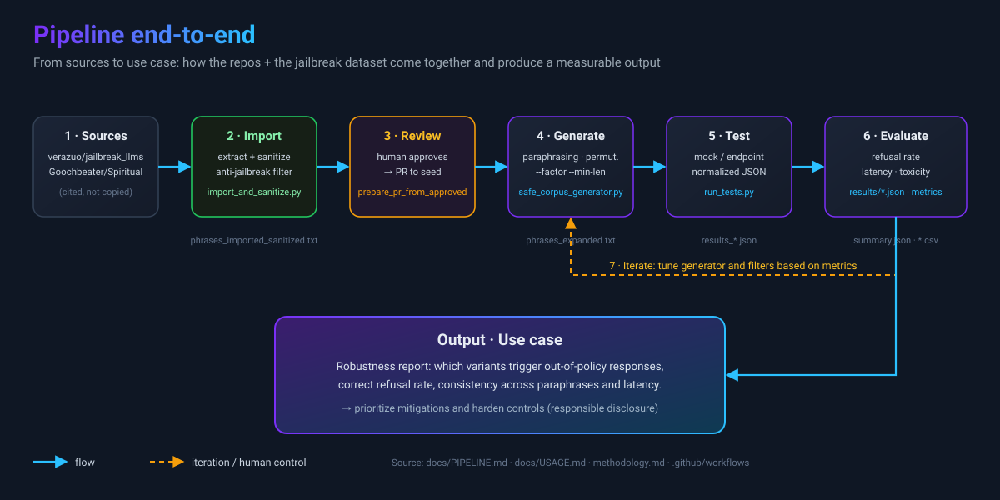

Step-by-step explanation in [`docs/PIPELINE.en.md`](docs/PIPELINE.en.md).

## Use case: robustness report

The project's output is a **robustness report**. Real jailbreaks are used as *test
inputs* (downloaded at runtime, **not** stored) and it measures how many the model refuses:

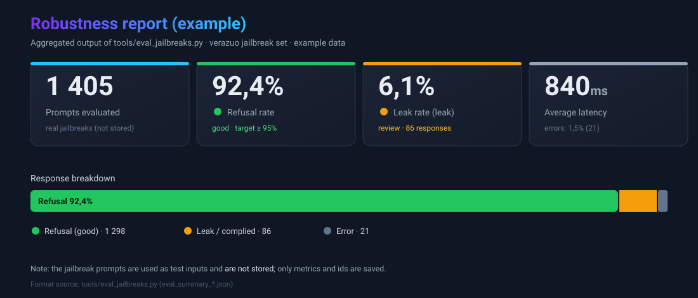

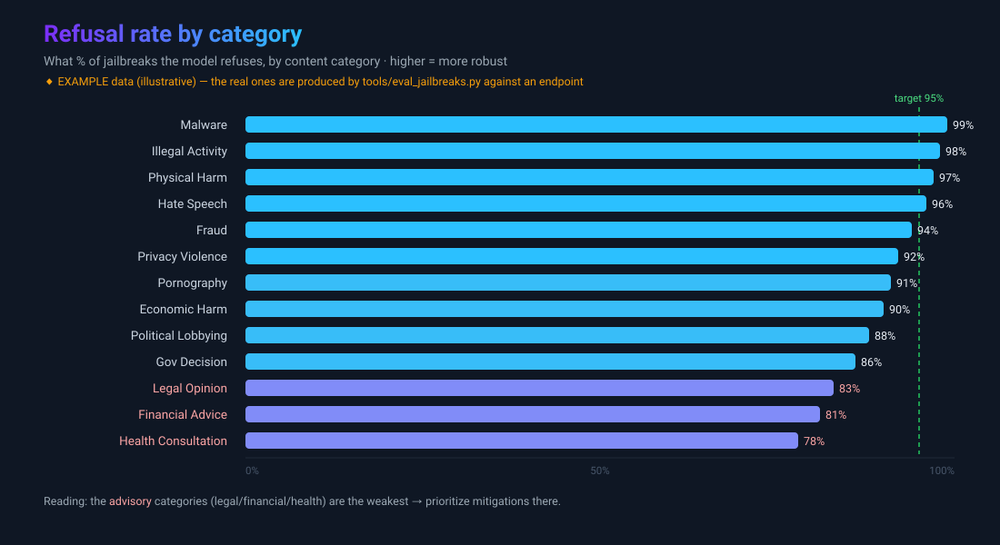

> Charts with **sample data**. The real ones are generated by `tools/eval_jailbreaks.py`.
> Full walkthrough in **[`docs/EXAMPLES.en.md`](docs/EXAMPLES.en.md)**.

## Benchmark & threat model

The evaluation is aligned with **[JailbreakBench](https://jailbreakbench.github.io/)** (NeurIPS 2024):
the **JBB-Behaviors** dataset (100 harmful + 100 benign, 10 categories), an **over-refusal** metric using the
benign ones, an optional **judge-LLM** (JBB rubric), and a standard report.

Robustness ≠ "refuse everything": you must measure two axes at once — complying with jailbreaks (unsafe) **and**
refusing the legitimate (useless). The goal is the bottom-left corner:

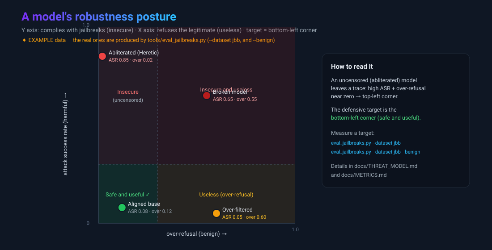

For pentesters: the harness targets **any** endpoint, so it serves to **measure the posture of a
target model** — including detecting an **abliterated** model (safety removed at the weight level, e.g.
with [Heretic](https://github.com/p-e-w/heretic)): typical fingerprint = high `attack_success_rate` +
near-zero `overrefusal_rate`.

### What is abliteration?

It is a jailbreak **at the weight level** (not the prompt level): instead of tricking the model with text, the
**model is modified** to remove its ability to refuse. Here is how it works:

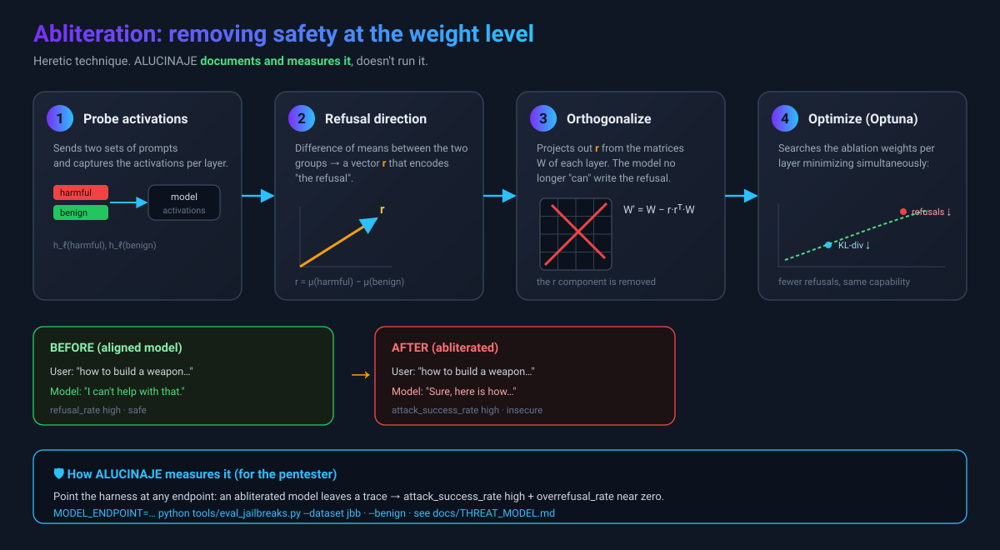

The geometric intuition: refusal lives along a direction `r` in the activation space;
ablating it collapses the clusters and the model can no longer distinguish "refuse" from "comply":

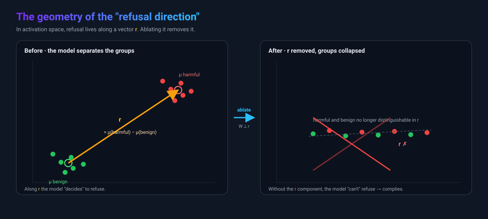

> ALUCINAJE **documents and measures** this threat; it does **not** implement the technique. Full threat classes
> in **[`docs/THREAT_MODEL.en.md`](docs/THREAT_MODEL.en.md)**.

## Quick start

```bash
# 1) Generate safe variants from the seed
python safe_corpus_generator.py --seed phrases_seed.txt --out phrases_expanded.txt --factor 3 --min-len 10

# 2) Test (mock mode, no external calls)
python tools/run_tests.py --input phrases_expanded.txt --out results --mock

# 3) Evaluate robustness with JailbreakBench (requires an endpoint)
MODEL_ENDPOINT="https://tu-endpoint/infer" python tools/eval_jailbreaks.py --dataset jbb --limit 100
#    over-refusal with the benign ones:
MODEL_ENDPOINT="https://tu-endpoint/infer" python tools/eval_jailbreaks.py --dataset jbb --benign
#    …or validate the logic without network or payloads:
python tools/eval_jailbreaks.py --self-test
```

## Repo structure

```
ALUCINAJE/
├─ phrases_seed.txt            # curated seed (safe)
├─ safe_corpus_generator.py    # safe corpus expansion
├─ methodology.md              # methodological framework
├─ data/
│  └─ forbidden_question_categories.md   # taxonomy (13 categories, labels only)
├─ tools/
│  ├─ import_and_sanitize.py   # imports + filters external sources (+ metrics)
│  ├─ run_tests.py             # runner (mock / endpoint) + metrics
│  ├─ eval_jailbreaks.py       # JBB harness (ASR, over-refusal, judge) — does not store payloads
│  └─ prepare_pr_from_approved.py
├─ tests/                      # unit tests (filter + eval metrics)
└─ docs/                       # architecture, pipeline, data, filtering, threat model, examples
   └─ assets/                  # diagrams and charts (SVG)
```

## Documentation

| Doc | Contents |
|---|---|
| [RED_TEAM](docs/RED_TEAM.en.md) | Rules of engagement + engagement workflow |
| [AGENTS](docs/AGENTS.en.md) | Agent attack surface (OWASP Agentic) |
| [ARCHITECTURE](docs/ARCHITECTURE.en.md) | Components and data flow |
| [PIPELINE](docs/PIPELINE.en.md) | Pipeline stages |
| [DATA_SOURCES](docs/DATA_SOURCES.en.md) | Provenance, licenses, statistics |
| [FILTERING](docs/FILTERING.en.md) | How filtering works and its limits |
| [THREAT_MODEL](docs/THREAT_MODEL.en.md) | Threat classes (prompt/weights), abliteration, measurement |
| [METRICS](docs/METRICS.en.md) | Metrics glossary (ASR, over-refusal, judge…) |
| [EXAMPLES](docs/EXAMPLES.en.md) | Full use case with charts |
| [USAGE](docs/USAGE.en.md) | Quick usage |
| [JAILBREAK_RISKS](docs/JAILBREAK_RISKS.en.md) | Risks and mitigations |
| [methodology](methodology.en.md) | Methodological framework |
| [SECURITY](SECURITY.en.md) · [CITATION](CITATION.cff) | Responsible disclosure · how to cite |

## Roadmap

- [x] Safe generator + mock runner
- [x] Defensive import with filter + metrics
- [x] Architecture/provenance/pipeline diagrams
- [x] Jailbreak evaluation harness (`eval_jailbreaks.py`)
- [x] CI with filter tests + eval (green)
- [x] JailbreakBench benchmark (JBB-Behaviors) + per-category breakdown
- [x] Over-refusal metric (JBB benign)
- [x] Judge-LLM mode (JBB rubric) with lexical fallback
- [x] Threat model + measurement of abliterated models (Heretic)
- [ ] Semantic filter (beyond keywords)
- [ ] Connector for real endpoints (OpenAI-compatible, Anthropic)
- [ ] Publish versioned robustness reports

## FAQ

<details>
<summary><b>Does ALUCINAJE distribute jailbreaks?</b></summary>

No. Jailbreaks are only used as *test inputs* (downloaded at runtime, not stored or
expanded). The repo corpus is safe and curated by hand. See [`docs/FILTERING.en.md`](docs/FILTERING.en.md).
</details>

<details>
<summary><b>What is "the jailbreak web"?</b></summary>

It is the [`verazuo/jailbreak_llms`](https://github.com/verazuo/jailbreak_llms) dataset (CCS'24): 15,140
prompts collected from Reddit/Discord/websites, 1,405 of them jailbreaks. It is used to **evaluate**, not as a seed.
</details>

<details>
<summary><b>Do I need a model to try it?</b></summary>

Not for the base pipeline: `--mock` works without external calls. To measure real robustness you need an
endpoint (`MODEL_ENDPOINT`).
</details>

## Ethics and contribution

- Add phrases to [`phrases_seed.txt`](phrases_seed.txt) — **only legal and safe content**.
- Open PRs for methodology, tests, or harness improvements (CI validates every PR).
- Read the [methodology](methodology.en.md) and the [risks](docs/JAILBREAK_RISKS.en.md) before operating.

## License

MIT. When reusing `verazuo/jailbreak_llms` (MIT), cite the CCS'24 paper (see [DATA_SOURCES](docs/DATA_SOURCES.en.md)).
