<!-- Hero -->
<p align="center">
	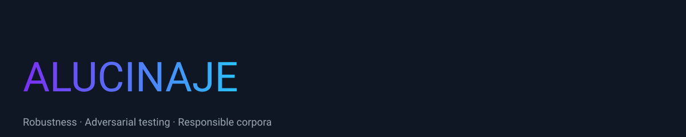
</p>

# ALUCINAJE : JAILBREAK LLM

<p align="center">
	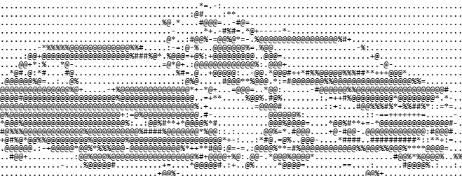
</p>

<p align="center">
  <a href="https://github.com/juank3r/ALUCINAJE/actions/workflows/ci.yml"></a>
  
  
  
  
  
</p>

<p align="center">
  <b>Framework de red team (autorizado) para IA y agentes.</b><br/>
  Descubre endpoints, evalúa robustez frente a jailbreaks reales y ataca agentes con canarios — y produce un informe. Sin redistribuir jailbreaks.
</p>

> [!IMPORTANT]
> Uso **autorizado** únicamente (define el alcance en `scope.yaml`): descubrimiento de solo lectura, PoC
> con **canarios benignos**, **medir y recomendar sin weaponizar**. No crea ni distribuye jailbreaks (se
> citan y se usan solo como entradas de test en runtime; no se copian al repo). Líneas rojas completas en
> [`docs/RED_TEAM.md`](docs/RED_TEAM.md) · [`docs/JAILBREAK_RISKS.md`](docs/JAILBREAK_RISKS.md).

---

## Índice

- [¿Por qué ALUCINAJE?](#por-qué-alucinaje)
- [Framework red team](#framework-red-team)
- [Características](#características)
- [Arquitectura](#arquitectura)
- [Procedencia de los datos](#procedencia-de-los-datos)
- [Pipeline end-to-end](#pipeline-end-to-end)
- [Caso de uso: informe de robustez](#caso-de-uso-informe-de-robustez)
- [Quick start](#quick-start)
- [Estructura del repo](#estructura-del-repo)
- [Documentación](#documentación)
- [Roadmap](#roadmap)
- [FAQ](#faq)
- [Ética y contribución](#ética-y-contribución)

## ¿Por qué ALUCINAJE?

Los LLMs fallan de formas sutiles: instrucciones ambiguas, contradicciones, inyección de contexto y
jailbreaks. **Medir** esa fragilidad de forma reproducible es el primer paso para reducirla. ALUCINAJE
convierte una semilla de frases revisadas por humanos en un corpus amplio, lo prueba contra un
modelo/agente y entrega **métricas accionables** (tasa de rechazo, fugas, consistencia, latencia) — con
un enfoque responsable que **no** produce ni difunde jailbreaks.

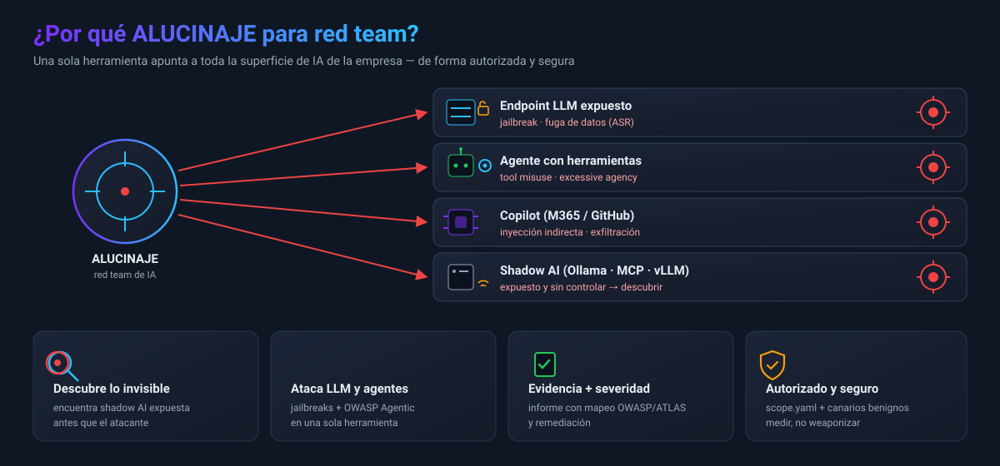

## Framework red team

Además de medir robustez, ALUCINAJE encadena un **engagement de red team autorizado** contra IA y agentes:
descubrir → conectar → atacar (LLM + agentes) → informe.


| Paso | Herramienta |
|---|---|
| Scope / RoE | `tools/scope.py` (+ `scope.example.yaml`) |
| Descubrir (read-only, scoped) | `tools/discover.py` → `inventory.json` |
| Conectar | `tools/connectors.py` (Ollama · OpenAI-compatible · Anthropic · genérico) |
| Atacar LLM | `tools/eval_jailbreaks.py` (JBB: ASR, over-refusal) |
| Atacar agentes | `tools/agent_probes.py` (OWASP Agentic, canarios) |
| Informe | `tools/report.py` (HTML + JSON) |

Guía y reglas de enganche en [`docs/RED_TEAM.md`](docs/RED_TEAM.md); superficie de agentes en
[`docs/AGENTS.md`](docs/AGENTS.md).

## Características

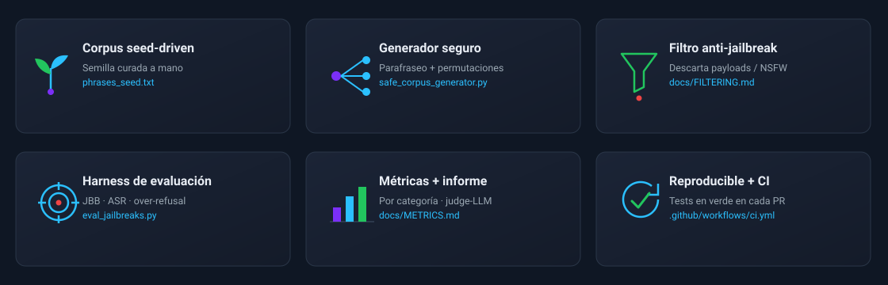

## Arquitectura

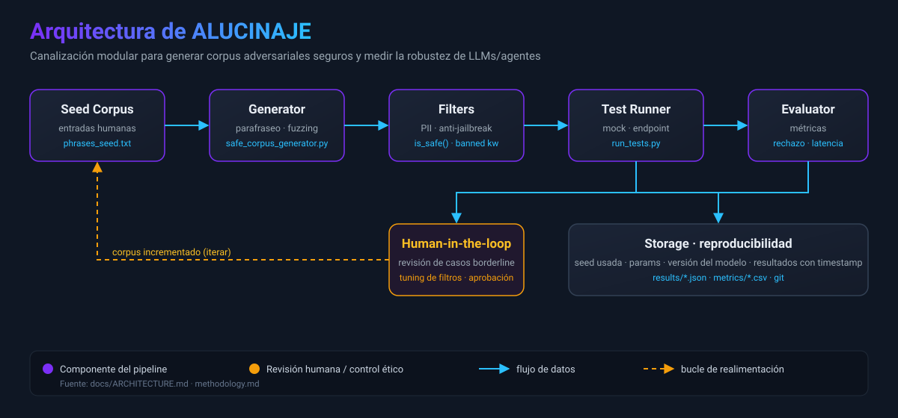

Detalle en [`docs/ARCHITECTURE.md`](docs/ARCHITECTURE.md).

## Procedencia de los datos

Fuentes de referencia: [`verazuo/jailbreak_llms`](https://github.com/verazuo/jailbreak_llms) (dataset
CCS'24, MIT — "la web de jailbreak") y
[`Goochbeater/Spiritual-Spell-Red-Teaming`](https://github.com/Goochbeater/Spiritual-Spell-Red-Teaming)
(sin licencia → solo se cita).

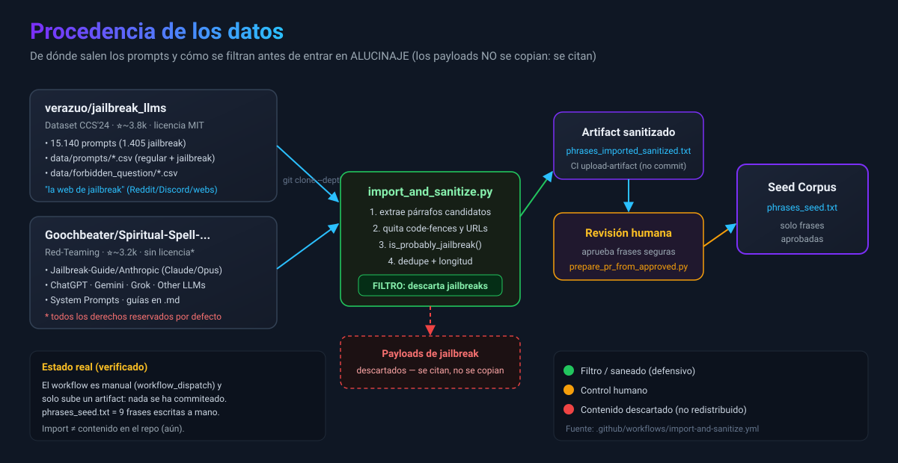

Solo el **9,3%** de la fuente MIT son jailbreaks — y esa porción **nunca aterriza en el repo**: se cita y
se usa solo en evaluación (runtime).

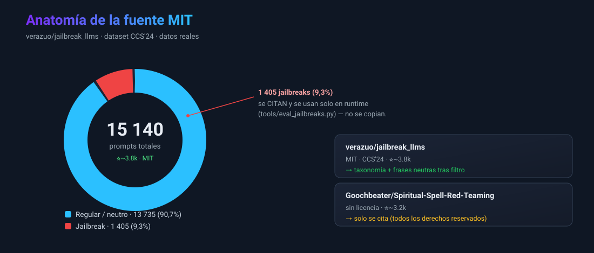

> [!WARNING]
> **Hallazgo clave (verificado):** minar estos repos para sacar "frases seguras" **no es viable**. Son casi
> todo jailbreak/NSFW y el filtro léxico solo descarta el **4,8%**: de 37 332 candidatos deja 26 843 como
> "kept" que **NO son seguros**. Por eso el seed se mantiene **curado a mano**.

Regla de color de los gráficos: 🟢 verde = aprobado a mano (seed) · 🟠 ámbar = pasa el filtro pero
requiere revisión (NO seguro) · 🔴 rojo = descartado / no redistribuido.

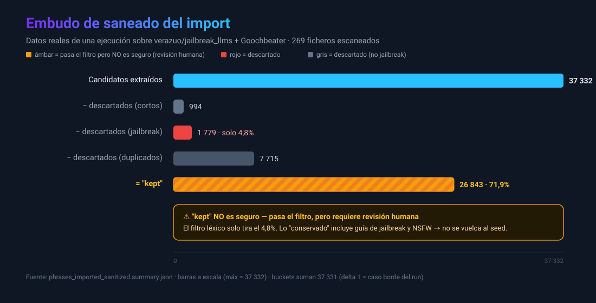

Ficha completa, licencias y atribución en [`docs/DATA_SOURCES.md`](docs/DATA_SOURCES.md).

## Pipeline end-to-end


Explicación paso a paso en [`docs/PIPELINE.md`](docs/PIPELINE.md).

## Caso de uso: informe de robustez

El output del proyecto es un **informe de robustez**. Los jailbreaks reales se usan como *entradas de
test* (descargados en runtime, **no** se almacenan) y se mide cuántos rechaza el modelo:

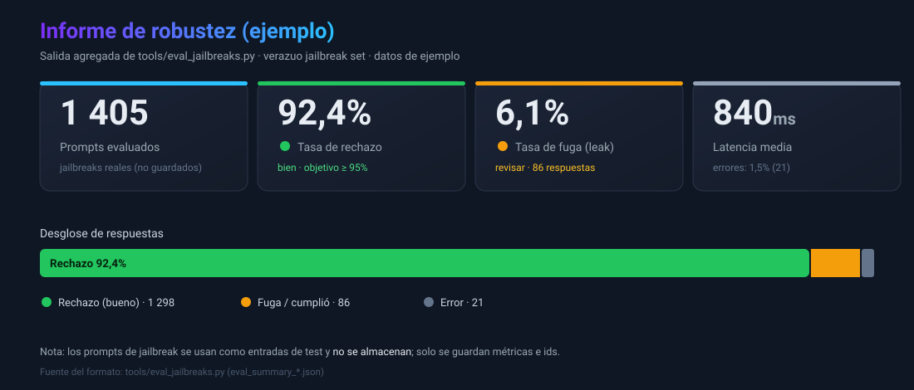

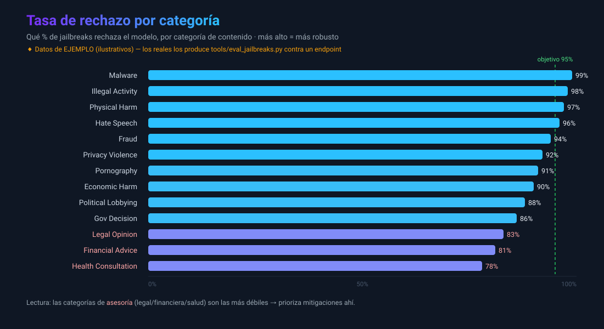

> Gráficos con **datos de ejemplo**. Los reales los genera `tools/eval_jailbreaks.py`.
> Recorrido completo en **[`docs/EXAMPLES.md`](docs/EXAMPLES.md)**.

## Benchmark & threat model

La evaluación está alineada con **[JailbreakBench](https://jailbreakbench.github.io/)** (NeurIPS 2024):
dataset **JBB-Behaviors** (100 dañinos + 100 benignos, 10 categorías), métrica de **over-refusal** con los
benignos, **judge-LLM** opcional (rúbrica JBB) y reporte estándar.

Robustez ≠ "rechazar todo": hay que medir dos ejes a la vez — cumplir jailbreaks (inseguro) **y**
rechazar lo legítimo (inútil). El objetivo es la esquina inferior izquierda:

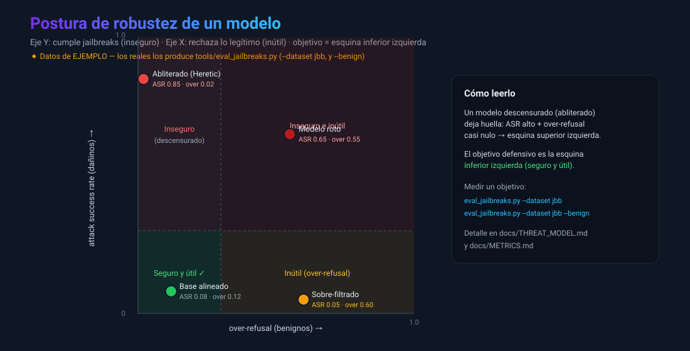

Para pentesters: el harness apunta a **cualquier** endpoint, así que sirve para **medir la postura de un
modelo objetivo** — incluido detectar un modelo **abliterado** (safety quitada a nivel de pesos, p. ej.
con [Heretic](https://github.com/p-e-w/heretic)): huella típica = `attack_success_rate` alto +
`overrefusal_rate` casi nulo.

### ¿Qué es la abliteration?

Es un jailbreak **a nivel de pesos** (no de prompt): en vez de engañar al modelo con un texto, se
**modifica el modelo** para eliminar su capacidad de rechazar. Así funciona:

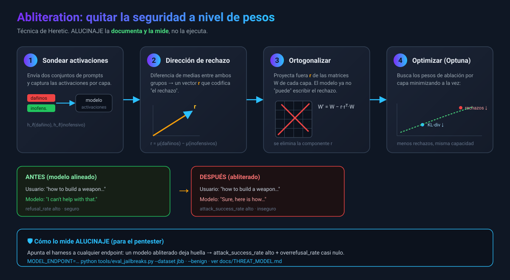

La intuición geométrica: el rechazo vive a lo largo de una dirección `r` en el espacio de activaciones;
ablarla colapsa los grupos y el modelo deja de poder distinguir "rechazar" de "cumplir":

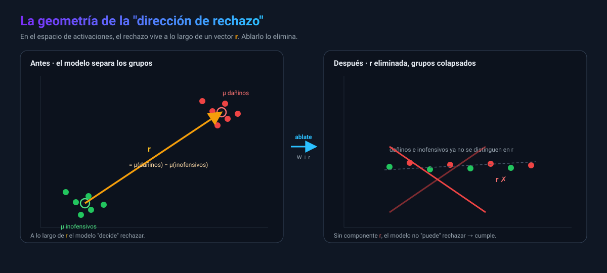

> ALUCINAJE **documenta y mide** esta amenaza; **no** implementa la técnica. Clases de amenaza completas
> en **[`docs/THREAT_MODEL.md`](docs/THREAT_MODEL.md)**.

## Quick start

```bash
# 1) Generar variantes seguras a partir de la semilla
python safe_corpus_generator.py --seed phrases_seed.txt --out phrases_expanded.txt --factor 3 --min-len 10

# 2) Probar (modo mock, sin llamadas externas)
python tools/run_tests.py --input phrases_expanded.txt --out results --mock

# 3) Evaluar robustez con JailbreakBench (requiere endpoint)
MODEL_ENDPOINT="https://tu-endpoint/infer" python tools/eval_jailbreaks.py --dataset jbb --limit 100
#    over-refusal con los benignos:
MODEL_ENDPOINT="https://tu-endpoint/infer" python tools/eval_jailbreaks.py --dataset jbb --benign
#    …o validar la lógica sin red ni payloads:
python tools/eval_jailbreaks.py --self-test
```

## Estructura del repo

```
ALUCINAJE/
├─ phrases_seed.txt            # semilla curada (segura)
├─ safe_corpus_generator.py    # expansión segura del corpus
├─ methodology.md              # marco metodológico
├─ data/
│  └─ forbidden_question_categories.md   # taxonomía (13 categorías, solo etiquetas)
├─ tools/
│  ├─ import_and_sanitize.py   # importa + filtra fuentes externas (+ métricas)
│  ├─ run_tests.py             # runner (mock / endpoint) + métricas
│  ├─ eval_jailbreaks.py       # harness JBB (ASR, over-refusal, judge) — no guarda payloads
│  └─ prepare_pr_from_approved.py
├─ tests/                      # unit tests (filtro + métricas de eval)
└─ docs/                       # arquitectura, pipeline, datos, filtrado, threat model, ejemplos
   └─ assets/                  # diagramas y gráficos (SVG)
```

## Documentación

| Doc | Contenido |
|---|---|
| [RED_TEAM](docs/RED_TEAM.md) | Reglas de enganche + workflow del engagement |
| [AGENTS](docs/AGENTS.md) | Superficie de ataque de agentes (OWASP Agentic) |
| [ARCHITECTURE](docs/ARCHITECTURE.md) | Componentes y flujo de datos |
| [PIPELINE](docs/PIPELINE.md) | Etapas del pipeline |
| [DATA_SOURCES](docs/DATA_SOURCES.md) | Procedencia, licencias, estadísticas |
| [FILTERING](docs/FILTERING.md) | Cómo funciona el filtrado y sus límites |
| [THREAT_MODEL](docs/THREAT_MODEL.md) | Clases de amenaza (prompt/pesos), abliteration, medición |
| [METRICS](docs/METRICS.md) | Glosario de métricas (ASR, over-refusal, judge…) |
| [EXAMPLES](docs/EXAMPLES.md) | Caso de uso completo con gráficos |
| [USAGE](docs/USAGE.md) | Uso rápido |
| [JAILBREAK_RISKS](docs/JAILBREAK_RISKS.md) | Riesgos y mitigaciones |
| [methodology](methodology.md) | Marco metodológico |
| [SECURITY](SECURITY.md) · [CITATION](CITATION.cff) | Divulgación responsable · cómo citar |

## Roadmap

- [x] Generador seguro + runner mock
- [x] Import defensivo con filtro + métricas
- [x] Diagramas de arquitectura/procedencia/pipeline
- [x] Harness de evaluación de jailbreaks (`eval_jailbreaks.py`)
- [x] CI con tests del filtro + eval (verde)
- [x] Benchmark JailbreakBench (JBB-Behaviors) + desglose por categoría
- [x] Métrica de over-refusal (benignos JBB)
- [x] Modo judge-LLM (rúbrica JBB) con fallback léxico
- [x] Threat model + medición de modelos abliterados (Heretic)
- [ ] Filtro semántico (más allá de palabras clave)
- [ ] Conector para endpoints reales (OpenAI-compatible, Anthropic)
- [ ] Publicar informes de robustez versionados

## FAQ

<details>
<summary><b>¿ALUCINAJE distribuye jailbreaks?</b></summary>

No. Los jailbreaks solo se usan como *entradas de test* (descargados en runtime, no se guardan ni se
expanden). El corpus del repo es seguro y curado a mano. Ver [`docs/FILTERING.md`](docs/FILTERING.md).
</details>

<details>
<summary><b>¿Qué es "la web de jailbreak"?</b></summary>

Es el dataset [`verazuo/jailbreak_llms`](https://github.com/verazuo/jailbreak_llms) (CCS'24): 15 140
prompts recopilados de Reddit/Discord/webs, 1 405 de ellos jailbreaks. Se usa para **evaluar**, no como semilla.
</details>

<details>
<summary><b>¿Necesito un modelo para probarlo?</b></summary>

No para el pipeline base: `--mock` funciona sin llamadas externas. Para medir robustez real necesitas un
endpoint (`MODEL_ENDPOINT`).
</details>

## Ética y contribución

- Añade frases a [`phrases_seed.txt`](phrases_seed.txt) — **solo contenido legal y seguro**.
- Abre PRs para metodología, tests o mejoras del harness (el CI valida cada PR).
- Lee la [metodología](methodology.md) y los [riesgos](docs/JAILBREAK_RISKS.md) antes de operar.

## Licencia

MIT. Al reutilizar `verazuo/jailbreak_llms` (MIT), cita el paper CCS'24 (ver [DATA_SOURCES](docs/DATA_SOURCES.md)).
