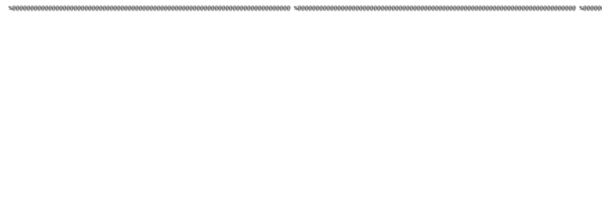

<!-- Hero -->
<p align="center">
  
</p>

<h1 align="center">ALUCINAJE — Jailbreak &amp; Robustez de LLMs</h1>

<p align="center">
  
  
  
  
</p>

<p align="center">
  Proyecto para <strong>generar corpus adversariales seguros</strong>, diseñar metodologías de prueba
  y <strong>evaluar la robustez</strong> de modelos de lenguaje y agentes.
</p>

> [!IMPORTANT]
> Este repositorio **evita crear o distribuir "jailbreaks"** destinados a evadir sistemas de
> seguridad. Su objetivo es **medir y mejorar la resiliencia** de los modelos. De las fuentes
> externas se importan frases seguras y taxonomía; los *payloads* de jailbreak se **citan, no se
> copian**. Ver [`docs/JAILBREAK_RISKS.md`](docs/JAILBREAK_RISKS.md) y
> [`docs/DATA_SOURCES.md`](docs/DATA_SOURCES.md).

## Índice

1. [Qué es](#qué-es)
2. [Arquitectura](#arquitectura)
3. [Procedencia de los datos](#procedencia-de-los-datos)
4. [Pipeline end-to-end](#pipeline-end-to-end)
5. [Quick start](#quick-start)
6. [Documentación](#documentación)
7. [Ética y contribución](#ética-y-contribución)

## Qué es

ALUCINAJE es una **canalización modular** que transforma una semilla de frases revisadas por humanos
en un conjunto amplio de variantes seguras, las prueba contra modelos/agentes y registra métricas de
robustez (tasa de rechazo correcto, consistencia entre parafraseos, latencia, etc.).

- **Seed-driven corpus** — [`phrases_seed.txt`](phrases_seed.txt) con frases semilla seguras.
- **Generador seguro** — [`safe_corpus_generator.py`](safe_corpus_generator.py) expande la semilla por
  parafraseo y permutaciones controladas, con filtros anti-jailbreak.
- **Runner + evaluación** — [`tools/run_tests.py`](tools/run_tests.py) ejecuta las variantes (mock o
  endpoint real) y produce resultados y métricas.

## Arquitectura


Detalle de cada componente en [`docs/ARCHITECTURE.md`](docs/ARCHITECTURE.md).

## Procedencia de los datos

De dónde salen los prompts y **cómo se filtran** antes de entrar en el repo. Los dos repos upstream de
referencia son [`verazuo/jailbreak_llms`](https://github.com/verazuo/jailbreak_llms) (dataset CCS'24,
"la web de jailbreak") y
[`Goochbeater/Spiritual-Spell-Red-Teaming`](https://github.com/Goochbeater/Spiritual-Spell-Red-Teaming).


Ficha completa, licencias y atribución en [`docs/DATA_SOURCES.md`](docs/DATA_SOURCES.md).

## Pipeline end-to-end

Cómo se juntan las fuentes, el saneado, la revisión humana, la generación y las pruebas hasta obtener
un **output / caso de uso** (informe de robustez).


Explicación paso a paso en [`docs/PIPELINE.md`](docs/PIPELINE.md).

## Quick start

```bash
# 1) Generar variantes seguras a partir de la semilla
python safe_corpus_generator.py --seed phrases_seed.txt --out phrases_expanded.txt --factor 3 --min-len 10

# 2) Ejecutar las pruebas (modo mock, sin llamadas externas)
python tools/run_tests.py --input phrases_expanded.txt --out results --mock

# 3) Revisar resultados y métricas
#    results/results_*.json  y  results/summary.json
```

Para importar frases desde fuentes externas (con filtro y revisión humana), ver
[`docs/DATA_SOURCES.md`](docs/DATA_SOURCES.md).

## Documentación

- [Wiki / Home](docs/HOME.md)
- [Arquitectura](docs/ARCHITECTURE.md)
- [Pipeline](docs/PIPELINE.md)
- [Fuentes de datos y procedencia](docs/DATA_SOURCES.md)
- [Uso rápido](docs/USAGE.md)
- [Riesgos de jailbreak](docs/JAILBREAK_RISKS.md)
- [Metodología](methodology.md)

<details>
<summary>Arte ASCII (galería)</summary>

<p align="center">
  
</p>
</details>

## Ética y contribución

- Añade nuevas frases a [`phrases_seed.txt`](phrases_seed.txt) — **solo contenido legal y seguro**.
- Abre PRs para mejoras de la metodología o nuevos tests.
- Lee la [metodología](methodology.md) y los [riesgos](docs/JAILBREAK_RISKS.md) antes de operar.
