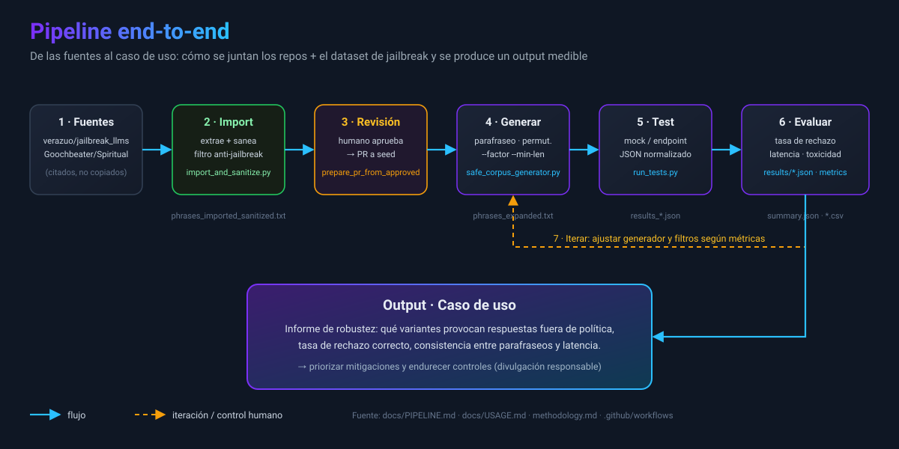

# Pipeline

Descripción
- La pipeline transforma una semilla humana en un conjunto amplio de variantes seguras que se prueban contra modelos. A continuación se describen las etapas; más abajo se conserva además un diagrama ASCII de alto nivel.

Etapas
- 1) Seed: frases semilla manuales.
- 2) Expand: generación por parafraseo, permutaciones y reglas.
- 3) Filter: aplican reglas de seguridad (PII, evasión, instrucciones dañinas).
- 4) Test: envío a modelos/agents con límites de tiempo y contexto controlado.
- 5) Eval: métricas automáticas + etiquetado humano.
- 6) Iterate: ajustar generador y filtros según resultados.

Diagrama ASCII (pipeline):

    +--------+    +----------+    +---------+    +------+    +---------+    +--------+
    |  Seed  | -> |  Expand  | -> | Filters | -> | Test | -> | Evaluator| -> | Human  |
    | (txt)  |    | (paraph) |    |  (safe) |    |(runner)|    | metrics |    | Review |
    +--------+    +----------+    +---------+    +------+    +---------+    +--------+

Detalles operativos
- Cada bloque es parametrizable: número de parafraseos, profundidad de permutaciones, umbrales de filtro.
- Tests se ejecutan en paralelo y las respuestas se normalizan (JSON con fields: input_id, variant, response, status, latency).
- Evaluator produce un CSV/JSON con métricas agregadas y casos individuales para revisión.

Ejemplo de artefactos generados
- `phrases_expanded.txt` — lista de variantes.
- `results/YYYYMMDD_modelX.json` — resultados por ejecución.
- `metrics/YYYYMMDD_modelX.csv` — métricas agregadas.
