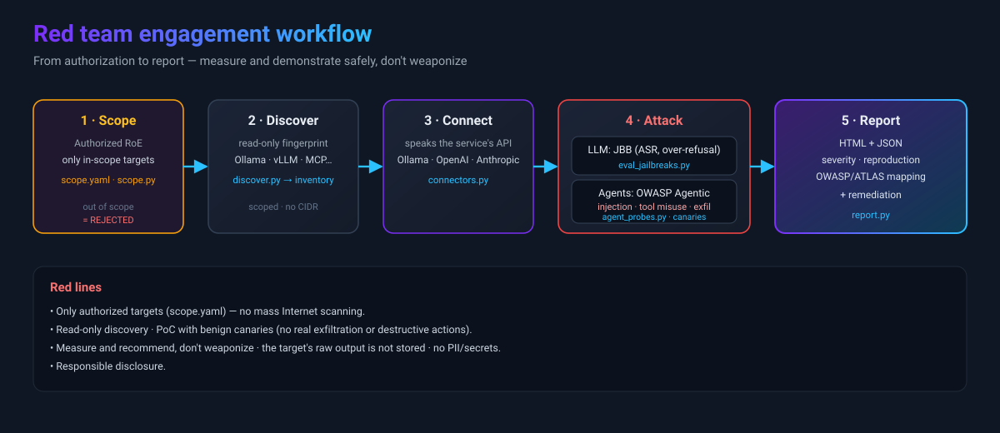

**English** | [Español](RED_TEAM.md)

# Red Team — rules of engagement and workflow

ALUCINAJE is used as an **authorized red team** framework to assess the security of AI systems
(LLM endpoints and agents). Before touching anything, read the **red lines**.



## Red lines (non-negotiable)

1. **Authorized targets only.** Everything goes through `scope.yaml`. Anything out of scope is **rejected**. No
   mass Internet scanning and no third parties without written authorization.
2. **PoC with benign canaries.** The vulnerability is *demonstrated* with harmless markers, never with
   real exfiltration, deletion, or destructive actions.
3. **Discovery = read-only** (non-intrusive HTTP probes).
4. **No weaponization.** No packaged operational exploits are generated, no uncensoring, and no
   redistribution of jailbreaks (only test inputs at runtime; they are not stored as a collection).
5. **No real PII/secrets** in reports; minimal evidence.
6. **Responsible disclosure** (`SECURITY.md`).

## Scope (Rules of Engagement)

Copy the template and define the authorized scope (client, authorization reference, dates, canary
marker, and the list of `targets` — IP/host/host:port/CIDR/URL). `scope.yaml` stays **out of git**
to avoid versioning client data:

```bash
cp scope.example.yaml scope.yaml     # edita scope.yaml con el alcance real
python tools/scope.py --show
python tools/scope.py --check https://ollama.internal.acme.test:11434
```

Tools that touch a target accept `--scope scope.yaml` and **reject** any target not listed.

## Engagement workflow

1. **Scope** — fill in `scope.yaml` with what is authorized.
2. **Discover** (`tools/discover.py --scope scope.yaml --out inventory.json`) — fingerprint of AI
   services in scope (read-only, no CIDR expansion) → `inventory.json`.
3. **Connect** — `tools/connectors.py` speaks the service API (Ollama, OpenAI-compatible, Anthropic, generic).
4. **Attack** —
   - LLM: `tools/eval_jailbreaks.py` (JBB: attack_success_rate, over-refusal, by category) — with `--service`/`--scope`.
   - Agents: `tools/agent_probes.py` — direct/indirect injection, tool misuse, excessive agency,
     secret leakage, exfiltration channel (all with canaries). See [`AGENTS.md`](AGENTS.en.md).
5. **Report** — `tools/report.py --in metrics --out report` → HTML + JSON with severity, reproduction, and
   OWASP/ATLAS mapping + remediation recommendations.

## Example (authorized)

```bash
# Ollama local declarado en scope.yaml
python tools/eval_jailbreaks.py --dataset jbb --limit 50 \
  --service ollama --model llama3 --scope scope.yaml \
  --out metrics    # MODEL_ENDPOINT=http://127.0.0.1:11434
```

Reference frameworks: OWASP Top 10 LLM Apps, OWASP Top 10 for Agentic Applications, MITRE ATLAS.
See [`THREAT_MODEL.md`](THREAT_MODEL.en.md) and (coming soon) [`AGENTS.md`](AGENTS.en.md).
