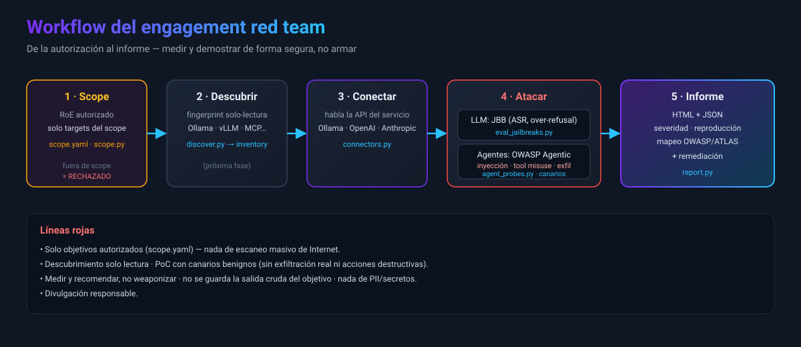

# Red Team — reglas de enganche y workflow

ALUCINAJE se usa como framework de **red team autorizado** para evaluar la seguridad de sistemas de IA
(endpoints LLM y agentes). Antes de tocar nada, lee las **líneas rojas**.



## Líneas rojas (no negociables)

1. **Solo objetivos autorizados.** Todo pasa por `scope.yaml`. Fuera de scope se **rechaza**. Nada de
   escaneo masivo de Internet ni de terceros sin autorización por escrito.
2. **PoC con canarios benignos.** Se *demuestra* la vulnerabilidad con marcadores inofensivos, nunca con
   exfiltración real, borrado o acciones destructivas.
3. **Descubrimiento = solo lectura** (probes HTTP no intrusivos).
4. **No weaponizar.** No se generan exploits operativos empaquetados, no se descensura, no se
   redistribuyen jailbreaks (solo entradas de test en runtime; no se guardan como colección).
5. **Nada de PII/secretos reales** en informes; evidencia mínima.
6. **Divulgación responsable** (`SECURITY.md`).

## Scope (Rules of Engagement)

Copia la plantilla y define el alcance autorizado (cliente, referencia de autorización, fechas, marcador
canario y la lista de `targets` — IP/host/host:puerto/CIDR/URL). `scope.yaml` queda **fuera de git**
para no versionar datos de cliente:

```bash
cp scope.example.yaml scope.yaml     # edita scope.yaml con el alcance real
python tools/scope.py --show
python tools/scope.py --check https://ollama.internal.acme.test:11434
```

Las herramientas que tocan un objetivo aceptan `--scope scope.yaml` y **rechazan** cualquier target no listado.

## Workflow del engagement

1. **Scope** — rellenar `scope.yaml` con lo autorizado.
2. **Descubrir** (`tools/discover.py`, próximo) — fingerprint de servicios IA en el scope → `inventory.json`.
3. **Conectar** — `tools/connectors.py` habla la API del servicio (Ollama, OpenAI-compatible, Anthropic, genérico).
4. **Atacar** —
   - LLM: `tools/eval_jailbreaks.py` (JBB: attack_success_rate, over-refusal, por categoría) — con `--service`/`--scope`.
   - Agentes: `tools/agent_probes.py` — inyección directa/indirecta, tool misuse, excessive agency,
     fuga de secretos, canal de exfiltración (todo con canarios). Ver [`AGENTS.md`](AGENTS.md).
5. **Informe** — `tools/report.py --in metrics --out report` → HTML + JSON con severidad, reproducción y
   mapeo OWASP/ATLAS + recomendaciones de remediación.

## Ejemplo (autorizado)

```bash
# Ollama local declarado en scope.yaml
python tools/eval_jailbreaks.py --dataset jbb --limit 50 \
  --service ollama --model llama3 --scope scope.yaml \
  --out metrics    # MODEL_ENDPOINT=http://127.0.0.1:11434
```

Marcos de referencia: OWASP Top 10 LLM Apps, OWASP Top 10 for Agentic Applications, MITRE ATLAS.
Ver [`THREAT_MODEL.md`](THREAT_MODEL.md) y (próximamente) [`AGENTS.md`](AGENTS.md).
